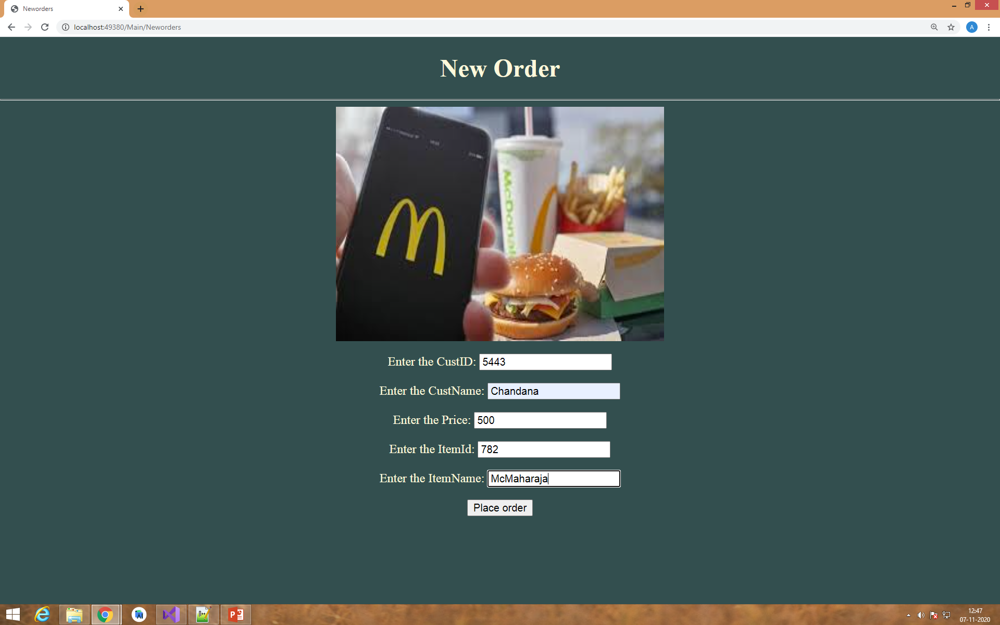

# 2009MYSSPSB1_C_SHARP

Contributors

 Anjali N Menon(99002446)
 
 Safura Zohareen(99002474)
 
 Sk Md Sohel(99002491)
 

C Sharp web app to manage restaurant(McDonalds) orders for the admin. 

Technolgies used:
C#
.NET Framework
MVC aechitecture
html
css

# Screenshots 

  
  
  
  
  

# Features:
     1. Login for Admin
     2. View to place order
     3. view to edit order
     4. view to show orders
     5. option to delete orders once it delivered
